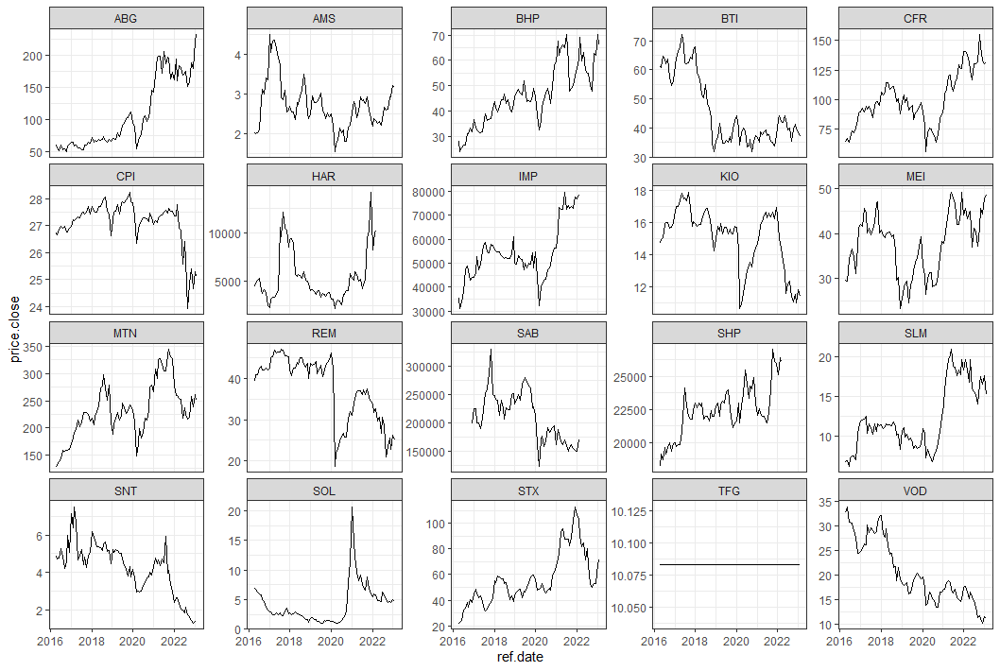
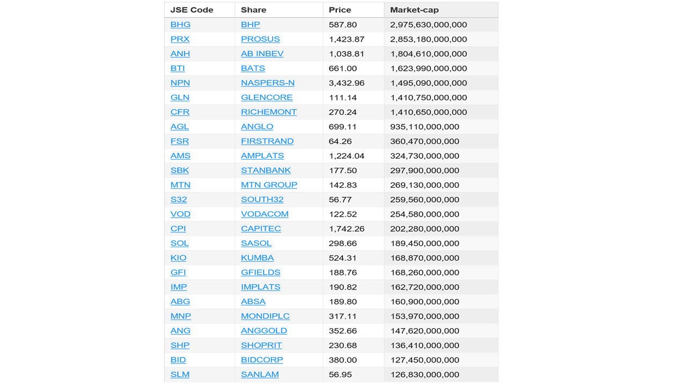
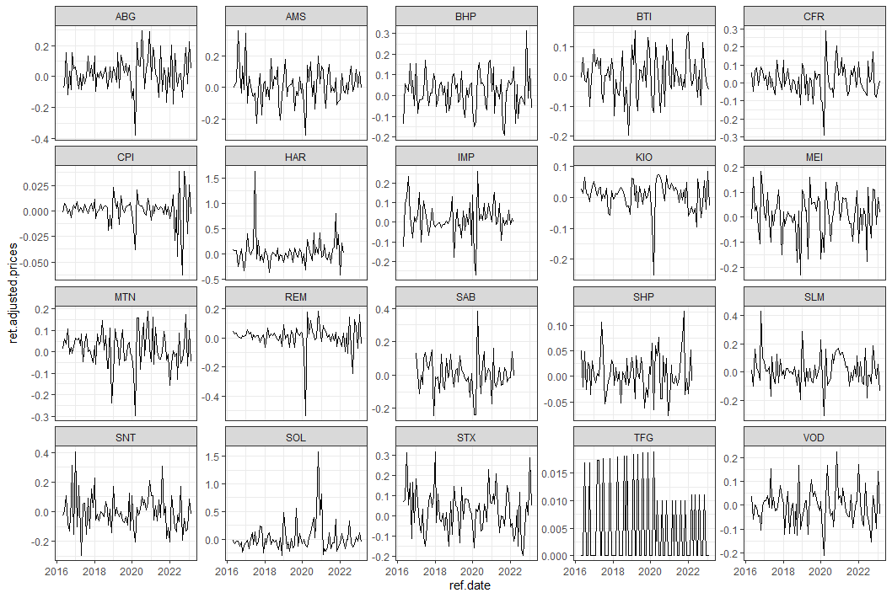

\newpage

# INTRODUCTION

The objective of this study is to investigate the phenomenon of delistings on the Johannesburg Stock Exchange (JSE) and to develop a stock price prediction machine learning model. Delistings on the JSE have become a growing concern, despite intervention efforts from the JSE and other stakeholders such as the central bank and central government. This study aims to address this economic problem by creating a machine learning model that can predict delistings using stock prices as a proxy, before they occur.

The significance of this study lies in its potential to provide valuable insights into the factors that contribute to delistings on the JSE and to develop a predictive tool that can help prevent future delistings. By understanding the factors that contribute to delistings, stakeholders can take appropriate measures to prevent or mitigate the occurrence of delistings.

The key question this study intends to answer is whether stock prices can be used as a proxy to predict delistings on the JSE and if so, to what extent can the prediction model help prevent future delistings. Through the development of a stock price prediction machine learning model, this study aims to provide a solution to the continued rise in delistings on the JSE and contribute to the stability of the stock exchange and the economy as a whole.

We consider two approaches, the Auto Regressive Integrated Moving Average (Auto-ARIMA) method and a Recurrent Neural Network (RNN), then decide on the best model using the root mean square error. 


# BACKGROUND OF STUDY

According to [@BusinessTech2021], over the past 30 years, the number of companies listed on the Johannesburg Stock Exchange (JSE) has declined from 776 to just over 330, with an average of 14 delistings per year. This decline was partly due to consolidation and partly due to delisting of small businesses that do not meet the acceptable size and liquidity range for asset managers. Despite the decline in the number of companies, the total market capitalization of the JSE has increased, indicating a stronger market overall, something optimists where quick to point out. However, the CEO of the JSE acknowledged the criticism surrounding the delistings and noted it was a global phenomenon following the COVID-19 pandemic and the narrative in the republic had to change to attractive more capital into the country. Figure 1 shows the number of listings and delsitings from 1992 to 2021, with a clear upward trend on delistings. 


 A [@IOL2022] busines report noted that the number of delistings was increasing, with more than one in 10 local listed companies expected to delist. South Africa was in a seven-year losing streak, averaging 25 company delistings per year, and this trend was accelerating, with 18 companies already having delisted that year and another 14 delisting processes underway. There was public concern over the future of the JSE, with social media posts highlighting the ongoing delistings, including Massmart, Grindrod Shipping, and Rebosis Property Fund. Recenty, [@Bloomberg2023] reported that the FTSE/JSE Africa All Share Index currently features 136 companies, down from 165 in 2012, due to onerous regulatory and funding conditions. The JSE has proposed changes to its framework to attract more listings, while A2X, a competitor stock exchange, expects to double its number of listings and increase its market share in the coming year by offering a more attractive option of raising capital.
 
The decreasing number of listed companies on the JSE is causing alarm, as it not only reflects a weaker market but also raises questions about the future of the exchange. Some firms may have decided to delist due to reasons such as a preference to become a private company, a merger or acquisition by another firm, consolidation, financial struggles, or failure to comply with listing regulations. In the past three years, well-known companies like Adapt IT, Alaris, Huge Group, Telemasters, Massmart, Grindrod Shipping, and Rebosis Property Fund have delisted. The COVID-19 pandemic has further intensified the global trend of delisting, and the JSE is facing increased competition from alternative exchanges such as A2X, which presents itself as a more appealing option for companies looking to raise capital both inside and outside of South Africa. 
The decline in delistings from the JSE is a significant matter of concern that demands attention and action to secure the stability and future growth of the exchange. The JSE is predominantly an institutional market with limited participation from retail customers and has been criticized for its lack of deep retail customer involvement. Capital flight from the JSE is anticipated to continue. The JSE CEO, Leila Fourie, has stated that multiple factors, such as the macro environment and investor sentiment, are driving the number of listings and delistings.

In light of a clear increase in the number of delisitings, we investigate how share prices have moved and build machine learning model that try and predict the stock prices of 20 randomly selcted pcompanies still listed on the JSE. 

# LITERATURE REVIEW

[@cassim2000jse] provide a historical background of the JSE and its evolution from its inception in 1887 to its current form as a modern stock exchange. Cassim and Herbst provide an overview of the JSE's governance structure, its role in the South African economy, and the types of securities traded on the JSE. This study particularly highlighted the importance of the JSE as an indicator of the health of the South African economy and as a source of capital for companies in South Africa making it an institution of critical importance. In a similar study Addison and A. Odendaal, [@addison2008hist], provided a comprehensive overview of the JSE's history, starting from its establishment in 1887 to its development in the 20th century. Trace the evolution of the JSE and its role in the South African economy, focusing on the exchange's role in supporting the growth of new industries and providing capital for businesses, the article examined the JSE's innovations and how they have contributed to its growth and development. They discussed the introduction of new technologies, such as electronic trading systems, and the creation of new financial products, such as derivatives, which have enabled the JSE to compete with other leading stock exchanges in the world. The article highlighted the challenges faced by the JSE, including political and economic turmoil, and how the exchange has adapted to overcome these challenges. The authors concluded that the JSE has been a leading player in the financial industry, consistently adapting to changes in the economy and technology to maintain its position as one of the leading stock exchanges in Africa.
[@mcdonald2006post], studied the Johannesburg Stock Exchange (JSE) and its listings in the post-apartheid era. The study provided a historical background of the JSE, its role in the South African economy, and its evolution in the post-apartheid era. With an overview of the JSE's governance structure, its listing requirements, and the types of securities traded on the JSE, the article consequently highlighted the impact of the post-apartheid political and economic reforms on the JSE and its listings. The increased foreign investment in the JSE, and the growth of new industries and companies listed on the exchange were discussed as well as the challenges facing the JSE and its listings, including increased competition from other stock exchanges and the need for further economic and political reforms. [@mcdonald2006post], argued that the JSE had the potential to play a significant role in the growth and development of the South African economy, and that continued reforms where necessary to ensure its continued success.
[@alhawari2010delisting], demonstrated that delisting from the Johannesburg Stock Exchange can have significant impact on shareholder wealth and stock prices. They provided evidence on the phenomenon of delisting in emerging markets, specifically the Johannesburg Stock Exchange (JSE) and examined the reasons for delisting and the impact of delisting on firm value. The authors used a sample of delisted firms from the JSE for the period from 1997 to 2007. The results of the study show that the main reasons for delisting from the JSE are financial distress, management decisions, and mergers and acquisitions. The results also indicate that delisted firms experience a decline in firm value, and that the decline in firm value is more pronounced for firms that delist due to financial distress. The results of the study are relevant for investors, regulators, and policy makers in emerging markets.
Roy, et al, [@roy2010liq], study the liquidity and market quality of the Johannesburg Stock Exchange (JSE). They analyzed the liquidity and market quality of the JSE over a period of ten years (1997-2006) and compared the results with other major stock exchanges around the world. The authors find that the liquidity of the JSE is generally good, but there is a considerable amount of illiquidity in the market, particularly in the smaller stocks. They also find that the market quality of the JSE is lower than that of other major stock exchanges, due to a high degree of market manipulation, and the absence of regulations to prevent insider trading and other forms of market abuse. The authors suggested that the JSE should implement measures to improve market quality, such as increasing transparency, and strengthening regulations to prevent market abuse. They also recommend that the JSE should invest in new technologies, such as electronic trading systems, to improve the efficiency and competitiveness of the exchange.

[@chutta2015delist], The authors investigate the causes and consequences of delistings from the Johannesburg Stock Exchange (JSE). The study uses a sample of 50 companies that delisted from the JSE between 2006 and 2011 and compares them to a control sample of firms that remained listed during the same period. The results suggest that delistings are associated with lower liquidity, higher leverage, and lower profitability compared to firms that remain listed. The authors conclude that delisting is a negative outcome for both firms and investors and that regulators should consider policies that support the continued listing of firms on stock exchanges. 

According to Hugo and Chen, [@hugo2017determ], the determinants of delisting from the Johannesburg Stock Exchange include various financial and non-financial factors such as profitability, liquidity, and size.   The study examines the factors that lead firms to delist from the Johannesburg Stock Exchange (JSE). The authors use a panel data set of listed firms on the JSE over a period of 21 years to investigate the determinants of delistings. They find that firm-specific factors such as financial performance, size, and age, as well as market-wide factors such as macroeconomic conditions, play a significant role in the likelihood of delisting. The authors conclude that their findings provide important insights for policymakers and regulators looking to improve the functioning of stock exchanges in emerging markets.
[@ntusi2019impact], focus on the impact of delistings on shareholder wealth in the Johannesburg Stock Exchange (JSE). The authors used event study methodology to examine the impact of delistings announcements on shareholder wealth around the event. The results suggest that delistings announcements have a negative impact on shareholder wealth, and the magnitude of the effect is higher for smaller firms. The findings have implications for regulators and policymakers, suggesting the need for increased monitoring of delistings to protect the interests of small shareholders.

[@magagula2020conseq], employed a sample of 25 firms delisted from the JSE between 2013 and 2016 and uses event study methodology to examine the stock prices of these firms both prior to and after delisting. The results suggest that delisting has a negative impact on stock prices, and the magnitude of this effect is influenced by the reasons for delisting and the characteristics of the firms involved. The authors conclude that regulators should be mindful of the negative effects of delisting and work to ensure that such events are managed in a manner that minimizes harm to stakeholders.

# METHODOLOGY

## DATA ISSUES 

The R code is used to retrieve stock price data for 20 different companies listed on the JSE (Johannesburg Stock Exchange). The data includes the volume of stocks, open, high, low, close, and adjusted prices. The relevant libraries are loaded and the BatchGetSymbols function is used to retrieve the stock prices from January 2016 to the current date with a monthly frequency. The returned data is stored in a data.table called stocks_data and ordered by ticker and ref.date. The tickers for these 20 companies include "HAR", "SNT", "STX", "TFG", "BHP", "SAB", "BTI", "CFR", "AMS", "MTN", "VOD", "CPI", "SOL", "KIO", "ABG","SHP","SLM", "IMP", "SSW", "MEI", "REM" and represent firms such as Harman International Industries, Sanlam, Seagate Technology, The Foschini Group, BHP Group, British American Tobacco, Compagnie Financière Richemont, Amsterdam Molecular Therapeutics, MTN Group, Vodafone Group, Cape plc, Solaredge Technologies, Kerry Group, African Rainbow Minerals, Shoprite Holdings, Standard Life Aberdeen, Impala Platinum Holdings, Seaspan Corporation, Metair Investments, and Rand Merchant Insurance Holdings.

## DATA PROPERTIES

We perform unit root tests on all 20 time series data sets, focusing on the closing stock prices which we will use in our analysis. We use the Augmented Dickey Fuller. The null hypothesis for the Augmented Dickey-Fuller (ADF) unit root test is that the time series has a unit root, meaning it is non-stationary. In other words, the hypothesis is that the time series has a trend and there is a systematic pattern to its behavior that cannot be explained by random fluctuations. The alternative hypothesis is that the time series is stationary, meaning it has a constant mean, variance, and autocorrelation structure. The goal of the ADF test is to determine whether the null hypothesis can be rejected based on the observed data. If the p-value of the test is less than 5%, the null hypothesis is rejected and the time series is considered to be stationary. If the p-value is greater than the significance level, then the null hypothesis cannot be rejected and the time series is considered to have a unit root and be non-stationary. We use a for-loop to iterate over all stocks and get the following results:

```{r data, echo=FALSE, warning=FALSE, message=FALSE, results='hide'}
library(pacman)
pacman::p_load(data.table, fixest, BatchGetSymbols, finreportr, tidyverse, lubridate, ggplot2)

first.date <- Sys.Date() - 2500
last.date <- Sys.Date()
freq.data <- "monthly"
tickers <- c("HAR", "SNT", "STX", "TFG", "BHP", "SAB", 
             "BTI", "CFR", "AMS", "MTN", "VOD", "CPI", "SOL", 
             "KIO", "ABG","SHP","SLM", "IMP", 
             "SSW", "MEI", "REM")

# Get Stock Prices
stocks <- BatchGetSymbols(tickers = tickers, 
                          first.date = first.date,
                          last.date = last.date, 
                          freq.data = freq.data,
                          do.cache = FALSE,
                          thresh.bad.data = 0)

## Verify Returns
stocks_data <- stocks$df.tickers %>% setDT() %>%          # Convert to data.table
  .[order(ticker, ref.date)]   
#head(stocks)

```


```{r unitroot, echo=FALSE, warning=FALSE, message=FALSE}

stocks_price_close <- stocks_data[, .(price.close), by = ticker]
library(tseries)

results <- data.table(ticker = character(0), test = character(0), statistic = numeric(0), p.value = numeric(0))
for (ticker in tickers) {
  price.close <- stocks_price_close[ticker == ticker, price.close]
  adf.test <- adf.test(price.close, k = 0)
  results <- rbind(results, data.table(ticker = ticker, test = "ADF", statistic = adf.test$statistic, p.value = adf.test$p.value))
}

library(knitr)

kable(results, caption = "Unit Root Test Results", align = c("l", "c", "c", "c"))
```

The time series's for all stocks have no unit roots and we conclude that they are stationary. 

## VARIABLE DESCRIPTION 

The main variable for this study is the closing stock price. We conduct a technical analysis which focuses only on price and does not consider a lot of other values like net profits, market sentiment, amount invested etc. This is common practice in univariate time series models where by the behavior of one particular time series is tacked over time and its relationship to its lags is analyzed. Univariate time series models usually consider the lags of the variable, known as the autoregressive part, as well as the lags of the error term, known as the moving average part. These are known as ARMA(p,q) models where p is number of variable lags and q the number of error lags. Should the series be none-stationary, a differencing parameter, d, is added to have an ARIMA(p,d,q) model.  This is the Box-Jenkins approach and we expect the movement of these stocks to be random thought to an extent predictable. In light of increased delistings, a fall in stock prices in future is likely.

## MODEL SELECTION AND SPECIFICATION

The Box-Jenkins approach is a time series modeling and forecasting method that involves a series of steps to identify the best model for a given data set, including data collection and analysis, model identification, estimation, diagnosis, and forecasting. It is a flexible and robust method for time series analysis and can be applied to data sets with trends, seasonality, and autocorrelation. However, it requires a good understanding of statistical techniques and modeling, and the process can be complex: [@box1976]

A technical analysis is done on twenty top performing comapnies on the JSE. Folowing the Box-Jenkins approach, we first implement an Auto-ARIMA model which, according to [@hyndaman2008auto], is a time series forecasting method that combines both ARIMA and machine learning techniques. The goal of Auto-ARIMA is to automatically determine the best ARIMA model parameters for a given time series, and to provide accurate forecasting results; Auto-ARIMA works by first performing an initial analysis of the time series data to identify trends, seasonality, and other patterns. Based on this analysis, the method then tests various ARIMA models and chooses the one that provides the best fit for the data. Auto-ARIMA also includes a stepwise model selection process, where it tries different combinations of p, d, and q parameters until it finds the optimal combination that minimizes the prediction error.

An ARIMA(p,d,q) can be specified as:

$$y_t = c + {\phi}_1y_{t-1} + {\phi}_2y_{t-2}+ .... +{\phi}_py_{t-p} - {\theta}_1e_{t-1} - {\theta}_2e_{t-2} - ... - {\theta}_qe_{t-q} + {\theta}_t$$

where $y_t$ is the current observation, $c$ is a constant term, ${\phi}_1$ to ${\phi}_q$ are the autoregressive coefficients, ${\theta}_1$ to ${\theta}_q$ are the moving average coefficients, $e_t$ is the residual (error) term and the parameters "p", "d" and "q" in the ARIMA model represent the order of the AR component, the degree of differencing required, and the order of the MA component, respectively.

The auto.arima() function in the R package "forecast" is used to automatically select the optimal ARIMA model based on the Akaike information criterion (AIC) and Bayesian information criterion (BIC). Once the ARIMA model has been fit to the time series data, it is used to generate forecasts for future observations, which can be adjusted for any exogenous variables by specifying them as the xreg argument in the forecast() function.

We then use the Recurrent Neural Network (RNN) on the same dataset. [@Hochreiter1997long] explained the RNN is a type of deep learning neural network that is designed to process sequential data. The network is trained to recognize patterns in sequences of data, and it can use these patterns to make predictions. RNNs are particularly well-suited to time series forecasting, as they can capture and retaining information about the past to inform future predictions. In an RNN, the hidden state of the network is updated at each time step based on both the current input and the previous hidden state. This allows the network to build a rich internal representation of the sequence, and to use this representation to make predictions about future events. A simple neural network representaion is:

$$h_t = \tanh(W_x \times x_t + W_h \times h_{t-1} + b)$$
$$y_t = W_y \times h_t + b_y$$

where $h_t$ is the hidden state at time $t$, $x_t$ is the input at time $t$, $W_x$ is the weight matrix for the input, $W_h$ is the weight matrix for the hidden state, $b$ is the bias vector $y_t$ is the output at time $t$, $W_y$ is the weight matrix for the output and $b_y$ is the bias vector for the output.

RNNs can be used with different types of activation functions, such as the Long Short-Term Memory (LSTM) or the Gated Recurrent Unit (GRU), to handle various types of sequences. This code is using the caret library to perform time series prediction using Recurrent Neural Network (RNN) model. The data is split into train and test sets for each stock using createDataPartition and lapply functions. The RNN model is defined in the rnn_model function. This function takes the train and test data for each stock and trains the model using the caret's train function. The predict function is then used to make predictions on the test data. The sapply function is used to apply the rnn_model to each stock. The final result is stored in the predictions object.


# VISUALISATIONS

The top 20 companies on the JSE as at 11 February 2023 are shown in Figure 3 in the appendix and these are some of the companies used in our analysis. Firstly, the graphs show how some for he biggest companies on the JSE in terms of market capitalization have performed from 2016 to date have performed. Companies like ABSA (ABG), BHP Group Limited (BHP), RICHEMONT (CFR), MTN GROUP (MTN ) and 	SHOPRIT (SHP) show a general upward trend whilst companies like SANTAM (SNT), VODACOM (VOD), AMPLATS (AMS) and BATS (BTI) show a persistent downward trend. 



The returns for all 20 stocks in this study, as shown in Figure 4 in the appendix, are mean reverting and hence ARIMA time series models can used when the stock prices are either differenced or logged. 


## DATA PRE-PROCESSING

The data pre-processing process involves preparing a time series data set for analysis and modeling. By focusing on only the "price.close" column, the data set is reduced to a single variable that represents the closing price of a financial instrument (such as a stock or a currency) at a given time. Next, the data set is split into two parts using the "caTools" package: the training set and the test set. The training set is used to fit the model, while the test set is used to evaluate its performance. This split is important because it allows the model to be tested on new, unseen data, which helps to assess its generalization ability and prevent overfitting. Overfitting occurs when a model is too closely fit to the training data and performs poorly on new, unseen data.


```{r training, echo=FALSE, warning=FALSE, message=FALSE, results='hide'}
stocks_price_close <- stocks_data[, .(price.close), by = ticker]

library(caTools)
# Building the Model
# Fit a time series model using the auto.arima() function in the forecast library
library(forecast)

# Split the data into training and test data sets
split <- sample.split(stocks_price_close$price.close, SplitRatio = 0.7)

mse <- data.frame(Ticker = character(), MSE = numeric(), stringsAsFactors = FALSE)

for (ticker in tickers) {
  stocks_price_close_train <- stocks_price_close[split == TRUE & ticker == ticker, ]
  stocks_price_close_test <- stocks_price_close[split == FALSE & ticker == ticker, ]
  
  # Building the Model
  # Fit a time series model using the auto.arima() function in the forecast library
  
  library(forecast)
  
  # Use the model to make predictions on the test data
  stocks_price_close_train$price.close <- as.numeric(stocks_price_close_train$price.close)
  
  auto.arima_model <- auto.arima(stocks_price_close_train$price.close,
                                 seasonal = TRUE,
                                 xreg = stocks_price_close_train$price.close)
  
  
  auto.arima_pred <- forecast(auto.arima_model, xreg = stocks_price_close_test$price.close)
  
  mse_temp <- mean((auto.arima_pred$mean - stocks_price_close_test$price.close)^2)
  mse <- rbind(mse, data.frame(Ticker = ticker, MSE = mse_temp))
}

```


# EVALUATING THE MODELS USING THE MSE

the Mean Squared Error (MSE) is a commonly used criterion for evaluating machine learning models and it is the average squared difference between the predicted values of a model and the actual values of the target variable. The idea behind MSE is to penalize large errors and reward models that make small errors. The smaller the MSE, the better the model is considered to be at making predictions.

The MSE error is given by: 

$$MSE = (1\div{N})\times\sum(y_i - \hat{y}_i)^2$$
Where $y_i$ is the actual value of the target variable for sample $i$ and $\hat{y}_i$ is the predicted value of the target variable for sample $i$.

The avearge mean square error is used to evaluate the model. 

```{r mae, echo=FALSE, warning=FALSE, message=FALSE, results='hide'}
mse_average <- mean(mse$MSE)
mse_average  
```

# CONCLUDING REMARKS

Only the prices where considered in this study, whereby future prices where predicted based on historic prices. These models are informative and with very small root mean square errors, they seem to good models. However, more informative models can be done using fundamental analysis, this implies that more than just the researcher takes into consideration more than just prices. Using fundamental analysis, machine learning models such as Artificial Neural Networks (ANNs), Support Vector Regression (SVR) and Random Forests can be utilized. These methodologies can be used to predict stock prices by considering a wide range of factors, such as technical indicators, market sentiment, and news articles. With more information in the model it is logical to assume we would get better predictions. 

\newpage

# APPENDIX





\newpage

# REFERENCES 

\bibliography{references.bib}


