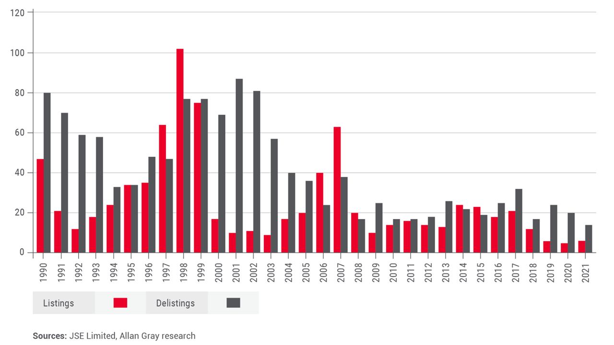

\newpage

# Firms Listed in Study 

1. "WHL": WHK Group Limited.
2. "MTN": MTN Group Limited.
3. "SOL": Sasol Limited.
4. "SHP": Shoprite Holdings Limited.
5. "BVT": Bavaria Industries Group Limited.
6. "IMP": Impala Platinum Holdings Limited.
7. "HAR": Harmony Gold Mining Company Limited.
8. "DSY": Distell Group Limited
9. "SNT": Santova Logistics Limited
10. "AIP": Afriplex (Pty) Ltd.
11. "RMB": Rand Merchant Bank (a division of FirstRand Bank Limited).
12. "STX": Satrix Limited.
13. "ADR": Adcock Ingram Holdings Limited.
14. "SBK": Standard Bank Group Limited.
15. "CFR": Clinix Health Group Limited.
16. "INL": Invicta Holdings Limited.
17. "TFG": The Foschini Group Limited.
18. "PSG": PSG Group Limited.
19. "KBO": Kalon Venture Capital Proprietary Limited.

\newpage

# Introduction

Following COVID19, concerns where raised over the number of delsitings on the Johannesburg Stock Exchange (JSE). With market commentators already discussing the 'slow death' of the JSE, it's CEO had to jump to it's defense. After taking note of the criticism, Fourie described South Africans congenitally negative and went on to plead with all stakeholders to put out positive sentiments that would ultimately crowd in investments. 

The figure below shows the number of listings and delsitings from 1992 to 2021. 




In light of a clear increase in the number of delisitings, we investigate how share prices have moved and build machine learning model that try and predict the stock prices of 20 randomly selcted pcompanies still listed on the JSE. 

# Literature Reveiw

[@cassim2000jse] provide a historical background of the JSE and its evolution from its inception in 1887 to its current form as a modern stock exchange. Cassim and Herbst provide an overview of the JSE's governance structure, its role in the South African economy, and the types of securities traded on the JSE. This study particularly highlighted the importance of the JSE as an indicator of the health of the South African economy and as a source of capital for companies in South Africa making it an institution of critical importance. In a similar study Addison and A. Odendaal, [@addison2008hist], provided a comprehensive overview of the JSE's history, starting from its establishment in 1887 to its development in the 20th century. Trace the evolution of the JSE and its role in the South African economy, focusing on the exchange's role in supporting the growth of new industries and providing capital for businesses, the article examined the JSE's innovations and how they have contributed to its growth and development. They discussed the introduction of new technologies, such as electronic trading systems, and the creation of new financial products, such as derivatives, which have enabled the JSE to compete with other leading stock exchanges in the world. The article highlighted the challenges faced by the JSE, including political and economic turmoil, and how the exchange has adapted to overcome these challenges. The authors concluded that the JSE has been a leading player in the financial industry, consistently adapting to changes in the economy and technology to maintain its position as one of the leading stock exchanges in Africa.
[@mcdonald2006post], studied the Johannesburg Stock Exchange (JSE) and its listings in the post-apartheid era. The study provided a historical background of the JSE, its role in the South African economy, and its evolution in the post-apartheid era. With an overview of the JSE's governance structure, its listing requirements, and the types of securities traded on the JSE, the article consequently highlighted the impact of the post-apartheid political and economic reforms on the JSE and its listings. The increased foreign investment in the JSE, and the growth of new industries and companies listed on the exchange were discussed as well as the challenges facing the JSE and its listings, including increased competition from other stock exchanges and the need for further economic and political reforms. [@mcdonald2006post], argued that the JSE had the potential to play a significant role in the growth and development of the South African economy, and that continued reforms where necessary to ensure its continued success.
[@alhawari2010delisting], demonstrated that delisting from the Johannesburg Stock Exchange can have significant impact on shareholder wealth and stock prices. They provided evidence on the phenomenon of delisting in emerging markets, specifically the Johannesburg Stock Exchange (JSE) and examined the reasons for delisting and the impact of delisting on firm value. The authors used a sample of delisted firms from the JSE for the period from 1997 to 2007. The results of the study show that the main reasons for delisting from the JSE are financial distress, management decisions, and mergers and acquisitions. The results also indicate that delisted firms experience a decline in firm value, and that the decline in firm value is more pronounced for firms that delist due to financial distress. The results of the study are relevant for investors, regulators, and policy makers in emerging markets.
Roy, et al, [@roy2010liq], study the liquidity and market quality of the Johannesburg Stock Exchange (JSE). They analyzed the liquidity and market quality of the JSE over a period of ten years (1997-2006) and compared the results with other major stock exchanges around the world. The authors find that the liquidity of the JSE is generally good, but there is a considerable amount of illiquidity in the market, particularly in the smaller stocks. They also find that the market quality of the JSE is lower than that of other major stock exchanges, due to a high degree of market manipulation, and the absence of regulations to prevent insider trading and other forms of market abuse. The authors suggested that the JSE should implement measures to improve market quality, such as increasing transparency, and strengthening regulations to prevent market abuse. They also recommend that the JSE should invest in new technologies, such as electronic trading systems, to improve the efficiency and competitiveness of the exchange.

[@chutta2015delist], The authors investigate the causes and consequences of delistings from the Johannesburg Stock Exchange (JSE). The study uses a sample of 50 companies that delisted from the JSE between 2006 and 2011 and compares them to a control sample of firms that remained listed during the same period. The results suggest that delistings are associated with lower liquidity, higher leverage, and lower profitability compared to firms that remain listed. The authors conclude that delisting is a negative outcome for both firms and investors and that regulators should consider policies that support the continued listing of firms on stock exchanges. 

According to Hugo and Chen, [@hugo2017determ], the determinants of delisting from the Johannesburg Stock Exchange include various financial and non-financial factors such as profitability, liquidity, and size.   The study examines the factors that lead firms to delist from the Johannesburg Stock Exchange (JSE). The authors use a panel data set of listed firms on the JSE over a period of 21 years to investigate the determinants of delistings. They find that firm-specific factors such as financial performance, size, and age, as well as market-wide factors such as macroeconomic conditions, play a significant role in the likelihood of delisting. The authors conclude that their findings provide important insights for policymakers and regulators looking to improve the functioning of stock exchanges in emerging markets.
[@ntusi2019impact], focus on the impact of delistings on shareholder wealth in the Johannesburg Stock Exchange (JSE). The authors used event study methodology to examine the impact of delistings announcements on shareholder wealth around the event. The results suggest that delistings announcements have a negative impact on shareholder wealth, and the magnitude of the effect is higher for smaller firms. The findings have implications for regulators and policymakers, suggesting the need for increased monitoring of delistings to protect the interests of small shareholders.

[@magagula2020conseq], employed a sample of 25 firms delisted from the JSE between 2013 and 2016 and uses event study methodology to examine the stock prices of these firms both prior to and after delisting. The results suggest that delisting has a negative impact on stock prices, and the magnitude of this effect is influenced by the reasons for delisting and the characteristics of the firms involved. The authors conclude that regulators should be mindful of the negative effects of delisting and work to ensure that such events are managed in a manner that minimizes harm to stakeholders.


```{r data, echo=FALSE, warning=FALSE, message=FALSE, results='hide'}
library(pacman)
pacman::p_load(data.table, fixest, BatchGetSymbols, finreportr, tidyverse, lubridate, ggplot2)

library(pacman)
pacman::p_load(data.table, fixest, BatchGetSymbols, finreportr, tidyverse, lubridate, ggplot2)

first.date <- Sys.Date() - 2500
last.date <- Sys.Date()
freq.data <- "monthly"
tickers <- c("WHL", "MTN", "SOL", "SHP", "BVT", 
             "IMP", "HAR", "DSY", "SNT", "AIP", "RMB",
             "STX", "ADR", "SBK", "CFR", "INL", "TFG", "PSG", "KBO")

# Get Stock Prices
stocks <- BatchGetSymbols(tickers = tickers, 
                          first.date = first.date,
                          last.date = last.date, 
                          freq.data = freq.data,
                          do.cache = FALSE,
                          thresh.bad.data = 0)

## Verify Returns
stocks_data <- stocks$df.tickers %>% setDT() %>%          # Convert to data.table
  .[order(ticker, ref.date)]   
head(stocks)
```

## Including Plots

You can also embed plots, for example:

```{r returns_plot, echo=FALSE, warning=FALSE, message=FALSE, results='hide'}
returns_plot_all <- ggplot(stocks_data[ticker %in% c("MTN", "SOL", "STX", "RMB")], 
                           aes(x= ref.date, y = ret.adjusted.prices, colour = ticker)) +
  geom_line() + theme_bw() + 
  labs(title = "", x = "Date", y= "Monthly Returns", subtitle = "") 
returns_plot_all

```


```{r prices_plot, echo=FALSE, warning=FALSE, message=FALSE, results='hide'}
price_plot_all <- ggplot(stocks_data[ticker %in% c("MTN", "SOL", "STX", "RMB")], 
                         aes(x= ref.date, y = price.close, colour = ticker)) +
  geom_line() + theme_bw() + labs(title = "", x = "Date", y= "Closing Price", subtitle = "")

price_plot_all
```

# Pre-processing the Data

In our data pre-processing, we opt to get the data for only the "price.close" column. Using the caTools package we split the data set into our training set and the test set. 

```{r training, echo=FALSE, warning=FALSE, message=FALSE, results='hide'}
stocks_price_close <- stocks_data[, .(price.close), by = ticker]

library(caTools)

# Split the data into training and test data sets
split <- sample.split(stocks_price_close$price.close, SplitRatio = 0.7)
stocks_price_close_train <- stocks_price_close[split == TRUE, ]
stocks_price_close_test <- stocks_price_close[split == FALSE, ]

# Building the Model
# Fit a time series model using the auto.arima() function in the forecast library

library(forecast)

# Use the model to make predictions on the test data
stocks_price_close_train$price.close <- as.numeric(stocks_price_close_train$price.close)

auto.arima_model <- auto.arima(stocks_price_close_train$price.close,
                               seasonal = TRUE,
                               xreg = stocks_price_close_train$price.close)


auto.arima_pred <- forecast(auto.arima_model, xreg = stocks_price_close_test$price.close)
```

# Evaluating the Model

Calculate the mean absolute error (MAE)

```{r mae, echo=FALSE, warning=FALSE, message=FALSE, results='hide'}

auto.arima_pred$mean
stocks_price_close_test$price.close
mae <- mean(abs(auto.arima_pred$mean - stocks_price_close_test$price.close))
mae
```

# Concluding Remarks

# References 

\bibliography{references.bib}


